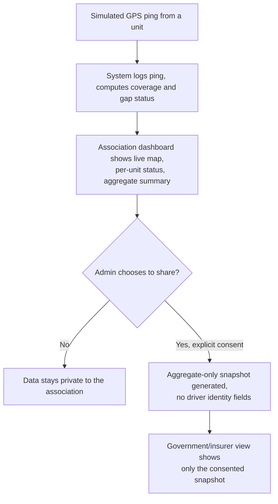
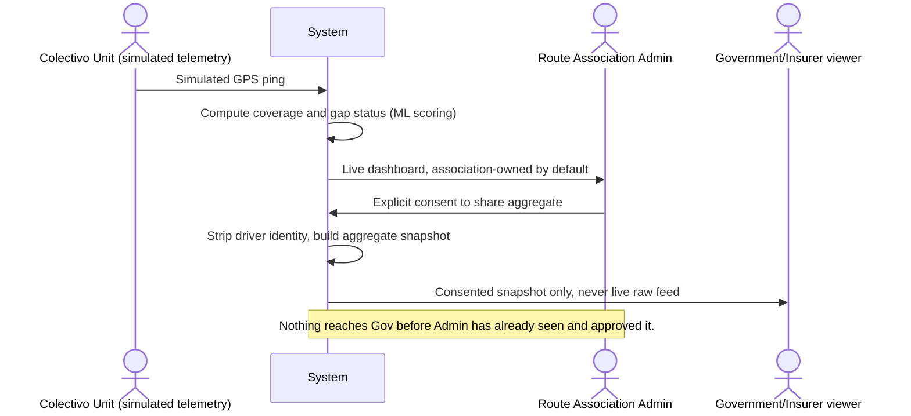

# PACKET, Bitacora (Week 7, Business Bending)
### Emilio Gomez Gonzalez, MONEY, Team 2
### Chapter 6, The Holy Driver

## Problem, in my own words

Every colectivo route in Mexico already gets measured by somebody. In CDMX, Articulo 110 has required GPS on every legally circulating unit since 2014, government-funded, tied to the mandatory Revista Vehicular inspection. In Estado de Mexico, SITRAMyTEM commissioned and paid for a real demand study on the Naucalpan corridors this year, to decide which routes survive a restructure. In both cases the measurement already exists or is already funded. What does not exist is the route association ever holding that same record for itself, before the government does. A Ruta 11 representative said as much at a real blockade at Metro Cuatro Caminos in mid-2026: the study that decides his routes' survival was built without the companies that have run the service for over 40 years ever being in the room. That is this week's Blueprint's whole finding, repeated four different ways by four different lenses: a low-power party gets measured, and is worse off or excluded from the result of their own measurement, exactly the harm Chamal's father lived when automation made human driving newly "legible" and he lost his job to it.

Bitacora is my declared slice of the team's fused vacuum: a colectivo legibility-and-safety instrument that the route association owns first, with a government or insurer buyer only allowed in downstream, by consent, once the association already holds and controls the record.

## Exact user

**Don Refugio, 52**, administers a small route-concession group, twelve units, somewhere in the Naucalpan restructure zone or a CDMX Article-110-covered corridor. He is not a technologist and does not want to become one. He is not the driver behind the wheel, he is the person who signs for the concession, answers to SITRAMyTEM or SEMOVI when they ask questions, and is currently the last person in the chain to see any data about his own operation, because the demand study or the compliance inspection is run and kept by whoever is deciding his routes' fate. He has run this route for decades. He has no independent way, today, to show up to a restructure hearing or a compliance review with his own evidence instead of waiting to be told the result.

## Success definition

Before this module closes: Don Refugio can sign in, see a live, self-owned dashboard of his own units, an approximate coverage map, and a compliance status against the Article-110-style GPS mandate (simulated telemetry, clearly labeled), export that record as his own evidence, and only then, through an explicit, revocable consent screen, choose to share an aggregate version of it with a named government body. The government view never exists before the association's own view does, and it never shows more than what was explicitly consented to. One full loop, sign in, see your own record, decide whether to share it, working end to end on the live URL.

## Mockup

Two screens generated this session (AI image generation, not a hand-drawn wireframe): the association's own coverage-and-compliance dashboard (map, per-unit status, "12 unidades, 11 activas"), and the explicit consent screen before any data leaves the association's control ("Vas a compartir: cobertura agregada de tus rutas. Nunca: identidad de choferes.").

## The world's best attempt (benchmark)

The best existing solutions on Earth for turning an existing mandate into a data product are Samsara (fleet telematics built on top of the US FMCSA's Electronic Logging Device mandate) and Verra Mobility (camera-based violation enforcement sold as a service to over 200 municipalities). Both got the mechanism right: the law already creates the data, the business just makes it usable. Both also got the ownership backwards for this build: in both cases the regulated party never holds the result first, the buyer (a fleet manager, a government) does. Bitacora localizes the mechanism but inverts the ownership: the same GPS-mandate-to-data-product logic, with the measured party, not the regulator, as the first and default owner of the record, matching this week's Blueprint's shadow clause directly.

## The long view (3 years)

If this slice works, Bitacora becomes the standard, association-owned compliance and ridership ledger for colectivo routes across both CDMX and Estado de Mexico, free for any route association to hold its own record, monetized through a paid export/analytics tier for associations and a paid, consent-gated aggregate subscription for government bodies (SITRAMyTEM, SEMOVI) and insurers once trust is earned. In three years, the same record that Ruta 11's representative wished he had at that blockade becomes the standard evidence every route association brings to a restructure hearing, closing the legibility gap the whole team's Blueprint identified without ever making enforcement the product's first purpose.

## Scope cut, what I am NOT building this week

- No real GPS hardware integration. Telemetry is simulated, clearly labeled on screen as simulated, per the security floor's no-real-personal-data rule.
- No real SEMOVI or SITRAMyTEM API integration. The "government view" is a second, simulated role inside this same app, clearly labeled, not a real government system.
- No automated penalty, scoring, or enforcement action of any kind, ever, per the Blueprint's Condition 3. This app only ever displays and shares, it never decides a consequence.
- No individual driver identity ever appears in the shared aggregate, only unit- and route-level status, per the consent screen's own stated promise.
- One route association only this week, not a multi-tenant marketplace of associations.
- No claim that this measures or improves real safety outcomes, per Condition 6, only coverage and compliance-signal visibility.

## Flow, flowchart (Mermaid)

## Flow, actors (swimlane)

## Architecture and stack

| Layer | Choice | Why |
|---|---|---|
| Frontend | Next.js App Router | Same proven base as prior weeks |
| Geodata/maps (Dragon Stack) | Leaflet + OpenStreetMap tiles, route/unit geodata stored in Postgres | Free, no API key required, matches the Dragon Stack floor |
| ML (Dragon Stack) | Simple gap/anomaly scoring: a unit's ping-interval history is scored against an expected interval; sustained deviation flags "possible disconnection" | Honest, explainable, no vendor claim of proven safety impact |
| Sensors/telemetry (Dragon Stack) | Simulated per-unit GPS ping generator, clearly labeled as simulated | Real GPS mandate exists (Article 110), hardware itself is out of scope this week |
| Auth | Supabase Auth, Google OAuth | Security floor requirement |
| Database | Supabase Postgres, RLS on every table | An association sees only its own units; the Gov role sees only consented snapshots |
| Core tables | `units`, `telemetry_pings`, `coverage_status`, `share_consents` | Matches the flow above directly |
| Hosting | Vercel | Free tier, same as prior weeks |

## Test plan

**Mechanical pass:** create one association-admin account, seed twelve simulated units, confirm the dashboard reflects live coverage/compliance status, confirm at least one unit can be made to show a gap and that the scoring flags it, confirm the consent screen accurately previews exactly what would be shared, confirm the Gov role sees nothing until consent is given and never sees driver-level identity, confirm RLS blocks the Gov role from any table beyond the consented snapshot. Find at least one real bug in this loop, fix it, redeploy.

**Persona test (Layer 1):** a fresh chat playing Don Refugio, walked screenshot by screenshot through sign-in, the dashboard, and the consent screen. Log every point of hesitation or confusion, fix the worst one before the deadline.
